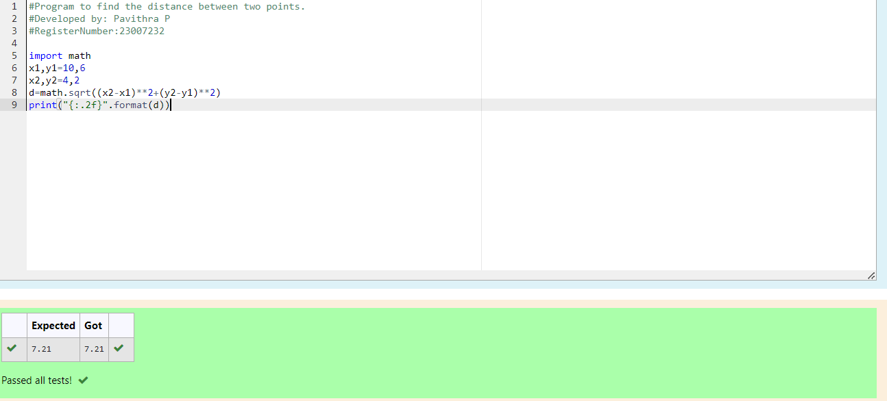

# DISTANCE-BETWEEN-TWO-POINTS

## AIM:
To write a python program to find the distance two 2 points
## ALGORITHM:
### Step 1:
first start the program 
### Step 2: 
give values for x,y
### Step 3: 
Substitute the values in the distance formula  
### Step 4: 
print the values
### Step 5: 
the expected output is came
### PROGRAM:
  ```PYTHON
  #Program to find the distance between two points.
#Developed by: Pavithra P
#RegisterNumber:23007232

import math
x1,y1=10,6
x2,y2=4,2
d=math.sqrt((x2-x1)**2+(y2-y1)**2)
print("{:.2f}".format(d))
  ```
## OUTPUT:



### RESULT:
The expected output for distance between two points is got in output